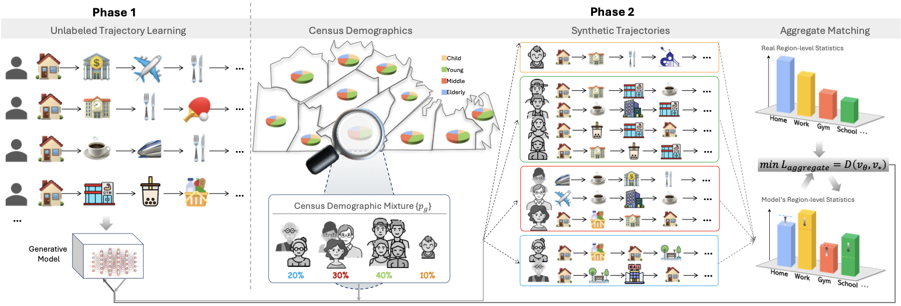

# ATLAS: Learning Demographic-Conditioned Mobility Trajectories with Aggregate Supervision

[](http://arxiv.org/abs/2603.03275)



Human mobility trajectories are widely studied in public health and social science, where different demographic groups exhibit significantly different mobility patterns. However, existing trajectory generation models rarely capture this heterogeneity because most trajectory datasets lack demographic labels. To address this gap in data, we propose **ATLAS**, a weakly supervised approach for demographic-conditioned trajectory generation using only (i) individual trajectories without demographic labels, (ii) region-level aggregated mobility features, and (iii) region-level demographic compositions from census data. ATLAS trains a trajectory generator and fine-tunes it so that simulated mobility matches observed regional aggregates while conditioning on demographics. Experiments on real trajectory data with demographic labels show that ATLAS substantially improves demographic realism over baselines (JSD ↓ 12%-69%) and closes much of the gap to strongly supervised training. We further develop theoretical analyses for when and why ATLAS works, identifying key factors including demographic diversity across regions and the informativeness of the aggregate feature, paired with experiments demonstrating the practical implications of our theory.

ATLAS is a two-phase trajectory generation pipeline:

- **Phase 1**: train a generative model on trajectories without demographic labels.
- **Phase 2**: fine-tune with demographic conditioning by sampling groups from the region's demographic composition and optimizing to match region's observed aggregate features.

## Table of Contents

- [Repository Structure](#repository-structure)
- [Environment Setup](#environment-setup)
- [Data](#data)
  - [Expected Split-Data Format](#expected-split-data-format)
  - [Data Preprocessing](#data-preprocessing)
    - [A) SQL pipeline (raw events -> modeling tables)](#a-sql-pipeline-raw-events---modeling-tables)
    - [B) Convert `traj.csv` + `demo.csv` to split-data format](#b-convert-trajcsv--democsv-to-split-data-format)
  - [ATLAS WORLD Data (for Phase 2)](#atlas-world-data-for-phase-2)
    - [1) Build demographic-group ATLAS WORLD](#1-build-demographic-group-atlas-world)
    - [2) Write configs for precompute](#2-write-configs-for-precompute)
    - [3) Precompute POI marginals and conditional cache](#3-precompute-poi-marginals-and-conditional-cache)
    - [3b) (Optional, for category-transition objective) Build `p_cat_transition.npz`](#3b-optional-for-category-transition-objective-build-p_cat_transitionnpz)
    - [4) Build length distributions](#4-build-length-distributions)
    - [5) Build supervised splits aligned to ATLAS WORLD](#5-build-supervised-splits-aligned-to-atlas-world)
    - [(Optional) Mixture / Rank-Deficient / Messy Worlds](#optional-mixture--rank-deficient--messy-worlds)
- [Training](#training)
  - [Phase 1](#phase-1)
  - [Phase 2](#phase-2)
- [Inference](#inference)
  - [Baseline inference (home/work only, no demo conditioning)](#baseline-inference-homework-only-no-demo-conditioning)
  - [Demo-conditioned inference (strong / ATLAS)](#demo-conditioned-inference-strong--atlas)
- [Evaluation](#evaluation)
- [Acknowledgements](#acknowledgements)

## Repository Structure

- `autoencoder/`: autoencoder training and evaluation (phase 1).
- `trajectory-generation/`: diffusion training, inference, evaluation, and precompute utilities (phase 1 and 2).
- `data_preprocessing/`: SQL + split-data conversion scripts.
- `helpers/`: ATLAS WORLD construction, config writing, split alignment, and mixture utilities.

Canonical entry scripts:

- Autoencoder train: `autoencoder/train_autoencoder/train_phase1_pretrain.py`
- Autoencoder eval: `autoencoder/eval/evaluate_phase1_pretrain.py`
- Diffusion train (phase1/strong): `trajectory-generation/scripts/training/train_dit_only.py`
- ATLAS phase2 train: `trajectory-generation/scripts/training/run_cbg_conditioned_training.py`
- Inference (home/work only): `trajectory-generation/scripts/inference/inference.py`
- Inference (home/work + demo): `trajectory-generation/scripts/inference/inference_demo.py`
- Eval by demographic group: `trajectory-generation/scripts/evaluation/eval_by_demo.py`

## Environment Setup

From repo root:

```bash
python3 -m venv .venv
source .venv/bin/activate
pip install --upgrade pip
pip install -r requirements.txt
```

Recommended env vars:

```bash
export REPO_ROOT="/absolute/path/to/ATLAS"
export YOUR_DATA_FOLDER="/absolute/path/to/your_split_data_root"
export ATLAS_WORLD_ROOT="/absolute/path/to/atlas_world_data"
```

`YOUR_DATA_FOLDER` should contain the split-data tree described below.

## Data

### Expected Split-Data Format

By default:

- `YOUR_DATA_FOLDER/controlled/train/`
- `YOUR_DATA_FOLDER/controlled/val/`
- `YOUR_DATA_FOLDER/controlled/test/`

Each split should contain:

- **`final_segments_all_train_data.pkl`**: per-segment training samples as a pandas DataFrame. The main field is `unique_id_seq`, which is the **POI token sequence** for each `segment_id` (plus `attention_mask`, and IDs like `individual_id`/`segment_id`).
- **`poi_map_feature.csv`**: POI metadata used for mapping tokens to coordinates/categories (at least `poi_id,lat,lon,top_category`; `sub_category` optional).
- **`all_attr_results.npy`**: conditioning attributes (`float32`, shape `[M,4]` = `[work_lat, work_lon, home_lat, home_lon]`), aligned row-wise with the rows in the `.pkl`.
- **`all_attr_results_with_demo.npy`**: same as above but includes demographics (`float32`, shape `[M,6]` adding `[age_bin, gender_id]`), aligned row-wise with the `.pkl`.
- **`all_timestamp.npy`** (optional): per-token timestamps (`datetime64[ns]`, shape `[M,max_len]`, padded with `NaT`).
- **`all_dwell.npy`** (optional): per-token dwell time in seconds (`float32`, shape `[M,max_len]`, padded with `0`).
- **`trajectory_length_ids.npy`**: empirical trajectory lengths (`int64`, shape `[M]`), typically the number of non-pad tokens (used for length conditioning).
- **`tokenizer/`**: a saved `BertTokenizerFast` directory (contains `vocab.txt` + tokenizer config; must match the tokenization used to build `unique_id_seq`).

### Data Preprocessing

#### A) SQL pipeline (raw events -> modeling tables)

Run SQL files in this order (Athena/Presto style):

1. `data_preprocessing/01_step1_visits_raw.sql`
2. `data_preprocessing/02_step2_visits_model.sql`
3. `data_preprocessing/03_step3_1_poi_counts.sql`
4. `data_preprocessing/03_step3_2_keep_topk_only.sql`
5. `data_preprocessing/03_step3_3_vocab_and_visits_final.sql`
6. `data_preprocessing/04_step4_daily_metrics.sql`
7. `data_preprocessing/05_step5_segments_14d_stride7.sql`
8. `data_preprocessing/06_step6_visits_seq_compressed.sql`
9. `data_preprocessing/07_step7_segment_visits_seq.sql`
10. `data_preprocessing/08_step8_filter_hw_users.sql`
11. `data_preprocessing/09_step9_user_split.sql`
12. `data_preprocessing/10_step10_user_profiles_hw.sql`

Main SQL outputs:

- `segment_visits14_hw_with_split` -> export as `traj.csv` (training sequence source)
- `user_profiles_hw` -> export as `demo.csv` (conditioning source)

#### B) Convert `traj.csv` + `demo.csv` to split-data format

```bash
python data_preprocessing/convert_to_split_data.py \
  --traj-csv /path/to/traj.csv \
  --demo-csv /path/to/demo.csv \
  --output-root "${YOUR_DATA_FOLDER}/controlled" \
  --token-col poi_token \
  --max-len 64 \
  --include-demo 
```

### ATLAS WORLD Data (for Phase 2)

#### 1) Build demographic-group ATLAS WORLD

Train:

```bash
python helpers/make_atlas_world_from_split.py \
  --split-root "${YOUR_DATA_FOLDER}/controlled/train" \
  --tokenizer-vocab "${YOUR_DATA_FOLDER}/controlled/tokenizer/vocab.txt" \
  --out-root "${ATLAS_WORLD_ROOT}/world_train_demogroups" \
  --region-mode demo_group \
  --min-region-size 500
```

Repeat for val/test by replacing `train` with `val` and `test` in both `--split-root` and `--out-root`.

#### 2) Write configs for precompute

Train:

```bash
python helpers/write_atlas_configs.py \
  --world-root "${ATLAS_WORLD_ROOT}/world_train_demogroups" \
  --vocab-path "${YOUR_DATA_FOLDER}/controlled/tokenizer/vocab.txt" \
  --out-config-dir "${ATLAS_WORLD_ROOT}/configs/train" \
  --out-aggregates-dir "${ATLAS_WORLD_ROOT}/aggregates/train" \
  --out-cache-dir "${ATLAS_WORLD_ROOT}/cache/train" \
  --num-special-tokens 5 \
  --num-genders 2
```

Repeat for val/test.

#### 3) Precompute POI marginals and conditional cache

```bash
python trajectory-generation/scripts/precompute/build_poi_marginals.py \
  --config "${ATLAS_WORLD_ROOT}/configs/train/poi_marginals_llp_world.yaml"

python trajectory-generation/scripts/precompute/cache_cbg_conditionals.py \
  --config "${ATLAS_WORLD_ROOT}/configs/train/cache_cbg_conditionals_llp_world.yaml"
```

Repeat for val/test configs.

#### 3b) (Optional, for category-transition objective) Build `p_cat_transition.npz`

If your Phase 2 config uses:

- `training.aggregate_feature: category_transition`
- `data.category_transition_npz: .../p_cat_transition.npz`

then generate it with:

```bash
python trajectory-generation/scripts/precompute/build_category_transition_marginals.py \
  --config "${ATLAS_WORLD_ROOT}/configs/train/category_transition_marginals_llp_world.yaml"
```

Repeat for val/test if you also evaluate/monitor transitions on those splits.

#### 4) Build length distributions

```bash
python helpers/build_length_dists_from_atlas_world.py \
  --world-root "${ATLAS_WORLD_ROOT}/world_train_demogroups" \
  --out-json "${ATLAS_WORLD_ROOT}/length_dists_train_demogroups.json" \
  --max-length 64 \
  --min-length 2 \
  --num-special-tokens 5
```

#### 5) Build supervised splits aligned to ATLAS WORLD

```bash
python helpers/make_supervised_split_aligned_to_world.py \
  --world-root "${ATLAS_WORLD_ROOT}/world_train_demogroups" \
  --out-data-dir "${ATLAS_WORLD_ROOT}/supervised_splits/demogroups_aligned" \
  --split train
```

Repeat for val/test.

#### (Optional) Mixture / Rank-Deficient / Messy Worlds

Use:

- `helpers/design_mixture_pi.py`
- `helpers/example_pi_matrix.json`
- `helpers/example_create_mix.sh`
- `helpers/make_atlas_mixture_world_from_demogroups.py`
- `helpers/make_atlas_mixture_world.py`

## Training

### Phase 1

#### 1) Autoencoder pretraining

Script: `autoencoder/train_autoencoder/train_phase1_pretrain.py`  
Example launcher: `autoencoder/train_autoencoder/example_train.sh`

#### (Optional, recommended) Compute latent normalization stats (stabilizes diffusion training)

Script: `trajectory-generation/scripts/precompute/compute_latent_pca.py`

Run this after Phase 1 autoencoder training.

In our standard pipeline, we primarily use this step to compute latent normalization
statistics (mean/std) with `--skip_pca`, which helps stabilize diffusion training.
The output file is still passed later via `--latent_pca_path`.

```bash
CUDA_VISIBLE_DEVICES=0 python trajectory-generation/scripts/precompute/compute_latent_pca.py \
  --autoencoder_path /path/to/phase1_autoencoder_checkpoint \
  --output_path /path/to/latent_stats/train.pt \
  --data_dir "${YOUR_DATA_FOLDER}" \
  --data_type controlled \
  --split train \
  --training_phase phase1 \
  --skip_pca \
  --max_length 64
```

#### 2) Diffusion pretraining (baseline)

Script: `trajectory-generation/scripts/training/train_dit_only.py`

Example:

```bash
python trajectory-generation/scripts/training/train_dit_only.py \
  --CONFIG trajectory-generation/configs/phase1-config/config_phase1_128.yml \
  --autoencoder_path /path/to/phase1_autoencoder_checkpoint \
  --data_dir "${YOUR_DATA_FOLDER}" \
  --data_type controlled \
  --training_phase phase1 \
  --prediction_type x0 \
  --beta_schedule cosine \
  --BATCH_SIZE 512 \
  --gradient_accumulation_steps 1 \
  --eval_steps 500 \
  --save_steps 5000 \
  --latent_pca_path /path/to/latent_pca.pt
```

### Phase 2

#### A) Strongly supervised (demo labels directly used)

Script: `trajectory-generation/scripts/training/train_dit_only.py`  
Example launcher: `trajectory-generation/scripts/training/phase2_strong.sh`

Use `--data_dir` pointing to:

- `${ATLAS_WORLD_ROOT}/supervised_splits/demogroups_aligned`

#### B) ATLAS aggregate-supervised fine-tuning

Script: `trajectory-generation/scripts/training/run_cbg_conditioned_training.py`  
Example launcher: `trajectory-generation/scripts/training/phase2_ATLAS.sh`  
Example configs:

- `trajectory-generation/configs/phase2-config/ATLAS/dit_llp_config.yaml`
- `trajectory-generation/configs/phase2-config/ATLAS/demogroups/*.yaml`
- `trajectory-generation/configs/phase2-config/ATLAS/mixturegroups/*.yaml`

## Inference

### Baseline inference (home/work only, no demo conditioning)

```bash
python trajectory-generation/scripts/inference/inference.py \
  --model_dir /path/to/phase1_model_dir/state_dicts \
  --model_file /path/to/phase1_dit_checkpoint \
  --config trajectory-generation/configs/phase1-config/config_phase1_128.yml \
  --autoencoder_path /path/to/phase1_autoencoder_checkpoint \
  --test_data_dir "${ATLAS_WORLD_ROOT}/supervised_splits/demogroups_aligned" \
  --data_split test \
  --data_type controlled \
  --num_samples 10000 \
  --num_steps 50 \
  --guidance_scale 1 \
  --length_penalty 1 \
  --num_beams 4 \
  --force_empirical_length \
  --beta_schedule cosine \
  --prediction_type x0 \
  --latent_pca_path /path/to/latent_pca.pt \
  --output_dir /path/to/output/baseline
```

### Demo-conditioned inference (strong / ATLAS)

Use `trajectory-generation/scripts/inference/inference_demo.py` for both strong and ATLAS runs.

```bash
python trajectory-generation/scripts/inference/inference_demo.py \
  --model_dir /path/to/model_dir \
  --model_file /path/to/model_file.pt \
  --config /path/to/config.yaml \
  --autoencoder_path /path/to/phase1_autoencoder_checkpoint \
  --test_data_dir "${ATLAS_WORLD_ROOT}/supervised_splits/demogroups_aligned" \
  --data_split test \
  --data_type controlled \
  --num_samples 10000 \
  --num_steps 50 \
  --guidance_scale 1 \
  --length_penalty 1 \
  --num_beams 4 \
  --force_empirical_length \
  --beta_schedule cosine \
  --prediction_type x0 \
  --latent_pca_path /path/to/latent_pca.pt \
  --output_dir /path/to/output/atlas_or_strong
```

## Evaluation

By demographic group:

```bash
python trajectory-generation/scripts/evaluation/eval_by_demo.py \
  --real_poi_pkl "${ATLAS_WORLD_ROOT}/supervised_splits/demogroups_aligned/controlled/test/final_segments_all_train_data.pkl" \
  --real_attr_with_demo_npy "${ATLAS_WORLD_ROOT}/supervised_splits/demogroups_aligned/controlled/test/all_attr_results_with_demo.npy" \
  --synthetic_poi_pkl /path/to/generated_poi_sequences.pkl \
  --synthetic_attr_npy /path/to/sampled_attributes.npy \
  --poi_map_csv "${YOUR_DATA_FOLDER}/controlled/test/poi_map_feature.csv" \
  --synthetic_name model_name \
  --save_dir /path/to/eval_output \
  --group_by age_gender \
  --min_count 1 \
  --histogram_bins 100 \
  --spatial_bins 100 \
  --grid_size 100
```

## Acknowledgements

The training pipeline is inspired by the following projects:

- [Leveraging the Spatial Hierarchy: Coarse-to-fine Trajectory Generation via Cascaded Hybrid Diffusion](https://github.com/urban-mobility-generation/Cardiff)
- [Latent Diffusion for Language Generation](https://github.com/justinlovelace/latent-diffusion-for-language)

We thank the authors for their high-quality implementations and open-source contributions.